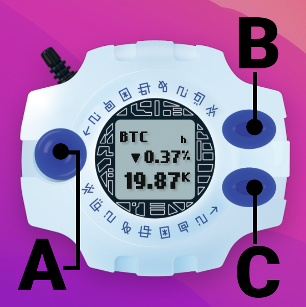
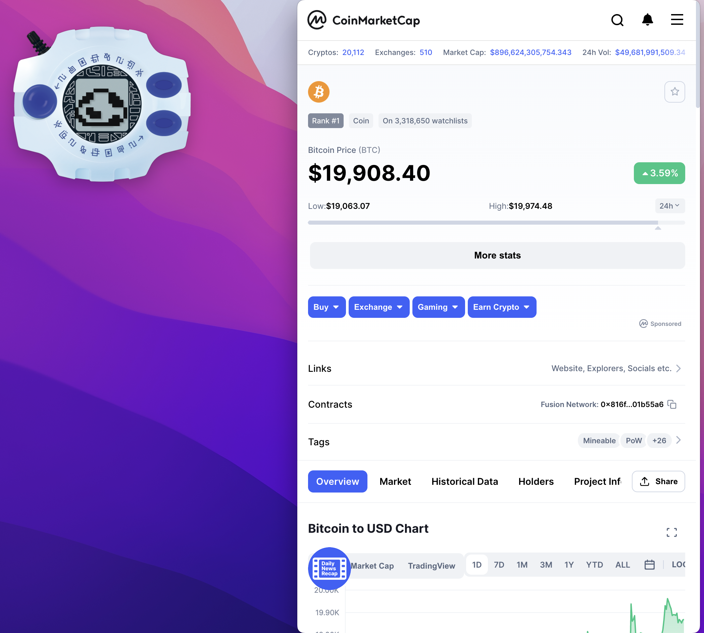
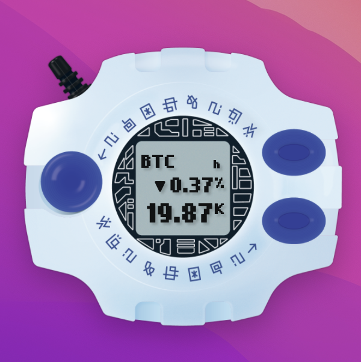
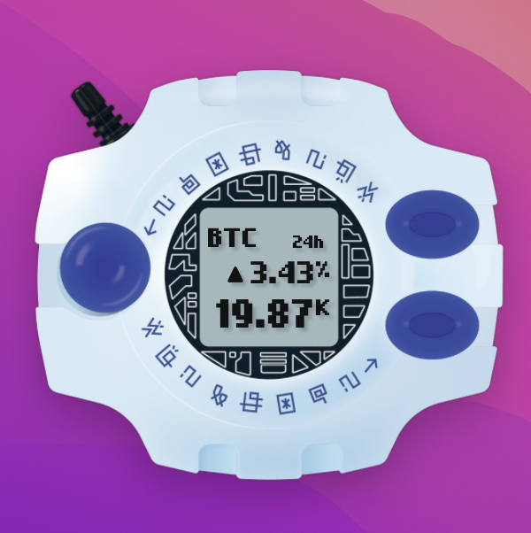
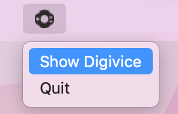

# Electron digivice

An electron app that shows the price of bitcoin and the change in value of the last hour or 24 hours. 

> ⚠️ This project was made for fun and education, the look is inspired on the fictional device "[Digivice](https://digimon.fandom.com/wiki/Digivice)" featured in the Digimon Adventure Series property of Toei Animation.

## Install
Clone or download this repository, then run with `yarn start`
## Use
### Coinmarketcap API KEY
For real data you need to set a valid API key  to the **CMKC_API_KEY** environment variable, otherwhise it will shold data from a coin market cap test API key.

**Sample .env file**
```
CMKC_API_KEY=[YOUR KEY]
DEV=false
TEST_API=false
```
### DEV
if set to `true` the electron app will show with window frame allowing to use the DeveloperTools for debugging.
### TEST_API
if set to `true` the test API will be used instead of your key, useful if you don't want to spend you api calls while tesing.

## Buttons

### A
The first time it opens a child window to the [bitcoin](https://coinmarketcap.com/currencies/bitcoin/) entry in coinmarketcap and change the data in screen for an egg animation.
A second push will close the child window and return to normal.

### B
Toggles between 1-hour and 24-hours mode for the %change in the currency.


### C
Minimize to tray (Mac) and from the tray icon you can open the window again or quit

